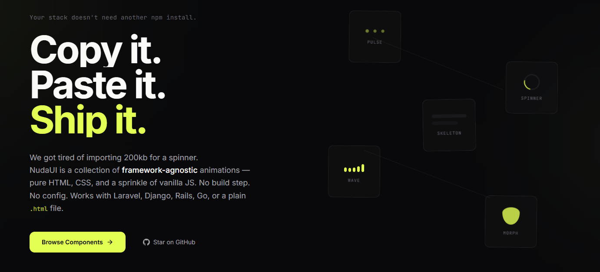

<div align="center">



# NudaUI

**Animations without the baggage.**

[](https://github.com/sgomez-dev/nudaui/stargazers)
[](./LICENSE)
[](https://github.com/sgomez-dev/nudaui/pulls)
[](https://developer.mozilla.org/en-US/docs/Web/CSS)
[](https://nudaui.vercel.app)

[**Live site →**](https://nudaui.vercel.app) &nbsp;·&nbsp; [**Browse components →**](https://nudaui.vercel.app/components)

</div>

---

Copy-paste CSS & JS animations that work everywhere. No npm install, no build step, no runtime. Drop the HTML and CSS into React, Vue, Svelte, Astro, Laravel, Django, Rails, or plain HTML — and ship.

You own the code. No package to update, no API to learn, no abstraction to fight.

## Preview

> _Add a GIF or short video here — e.g. `docs/demo.gif` or a YouTube embed._


## ✨ Features

- **Zero dependencies** — pure CSS, vanilla JS where needed. Nothing in your `node_modules`.
- **Copy-paste ownership** — shadcn/ui-style model. The code is yours the moment you paste it.
- **Framework-agnostic** — React, Vue, Svelte, Astro, Next, Nuxt, Laravel, Django, Rails, or a plain `.html` file.
- **Accessibility-aware** — `prefers-reduced-motion` respected, proper ARIA roles where it matters.
- **157 components across 25 categories** — loaders, text effects, 3D, scroll, micro-interactions and more.
- **Tailwind-friendly, Tailwind-optional** — works with your setup, not against it.

## 📦 Components

157 components, 25 categories.

| Category | Sample components | Count |
| --- | --- | --- |
| Loaders | Pulse Dots, Orbit, Ripple, Bars, Wave… | 15 |
| Text Effects | Scramble, Typewriter, Reveal, Gradient Sweep, Glitch… | 10 |
| Buttons | Magnetic, Liquid, Border Beam, Ripple, Shine… | 10 |
| Spinners | Ring, Dual Ring, Conic, Segment, Gradient… | 8 |
| Cards & Hover | Tilt, Glow, Lift, Flip, Border Trace… | 8 |
| Micro-interactions | Like burst, Copy-check, Shake, Pulse badge… | 8 |
| 3D Effects | Card flip, Perspective hover, Depth layers, Cube… | 8 |
| Indicators | Dot pulse, Live, Status rings, Signal… | 7 |
| Progress | Linear, Radial, Segmented, Stripe, Gradient fill… | 6 |
| Backgrounds | Aurora, Mesh, Grid pulse, Noise, Gradient flow… | 6 |
| Toggles & Inputs | Switch, Checkbox morph, Radio fill, OTP… | 6 |
| Borders & Outlines | Animated border, Trace, Dashed flow, Glow ring… | 5 |
| Badges & Tags | New, Beta, Pulse, Count, Gradient… | 5 |
| Navigation | Underline slide, Pill indicator, Tabs, Dropdown… | 5 |
| Notifications | Toast, Banner, Inline alert, Stacked… | 5 |
| Avatars | Ring, Status, Stack, Shimmer… | 5 |
| Placeholders | Skeleton line, Block, Shimmer, Wave… | 5 |
| Accordions & Tabs | Chevron, Plus/minus, Tab slide, Stack… | 5 |
| Dividers | Gradient, Dotted, Animated rule, Vertical… | 5 |
| Modals & Overlays | Scale in, Slide, Backdrop blur, Drawer… | 5 |
| Countdowns | Flip, Digit roll, Ring, Segment… | 4 |
| Marquees & Tickers | Linear, Pause-on-hover, Vertical, Gradient mask… | 4 |
| Scroll Effects | Fade in, Parallax, Reveal, Progress bar… | 4 |
| Cursors | Dot follower, Magnet, Trail, Blend… | 4 |
| Tooltips | Arrow, Fade, Slide, Glass… | 4 |

Full catalog: [nudaui.vercel.app/components](https://nudaui.vercel.app/components)

## 🚀 Quick start

Pick a component on [nudaui.vercel.app](https://nudaui.vercel.app/components), grab the HTML and CSS, paste. That's it.

```html
<!-- Pulse Dots Loader -->
<div class="nuda-pulse-dots" role="status" aria-label="Loading">
  <span></span>
  <span></span>
  <span></span>
</div>
```

```css
.nuda-pulse-dots {
  --pulse-dots-color: #a78bfa;
  --pulse-dots-size: 12px;
  display: flex;
  align-items: center;
  gap: 6px;
  padding: 8px;
}

.nuda-pulse-dots span {
  width: var(--pulse-dots-size);
  height: var(--pulse-dots-size);
  background: var(--pulse-dots-color);
  border-radius: 50%;
  animation: nuda-pulse 1.4s ease-in-out infinite;
}

.nuda-pulse-dots span:nth-child(2) { animation-delay: 0.2s; }
.nuda-pulse-dots span:nth-child(3) { animation-delay: 0.4s; }

@keyframes nuda-pulse {
  0%, 80%, 100% { transform: scale(0.4); opacity: 0.3; }
  40%           { transform: scale(1);   opacity: 1;   }
}
```

Tweak the CSS variables, rename the class, delete what you don't need. It's your code now.

## 🤔 Why NudaUI?

| Feature | NudaUI | Traditional animation library |
| --- | --- | --- |
| Dependencies | Zero | 5+ transitive packages |
| Install | Copy-paste | `npm install` + peer deps |
| Bundle cost | 0 KB added to your build | 50–200 KB gzipped |
| Framework support | Any (HTML works everywhere) | Usually React-only |
| Code ownership | Yours, in your repo | `node_modules/` |
| Customization | Full — edit the CSS | Limited by the library's API |
| Lock-in | None | High |

Animation libraries solve a real problem — they also drag in runtimes, APIs, and bundle weight you didn't ask for. NudaUI trades the abstraction for ownership.

## 🛠 Running this site locally

The repo is the marketing site + live component playground. The components themselves are pure CSS/JS — you don't need any of this to use them.

```bash
git clone https://github.com/sgomez-dev/nudaui.git
cd nudaui
npm install
npm run dev
```

Built with Next.js 16, React 19, TypeScript, and Tailwind v4.

## 🤝 Contributing

New components, fixes, and docs improvements are very welcome. Open an [issue](https://github.com/sgomez-dev/nudaui/issues) to discuss ideas, or send a PR for small additions directly.

Good first contributions:
- A new component in an existing category (see `src/components/showcase/registry/`)
- Accessibility improvements (reduced-motion, ARIA, focus states)
- Typos, clarifications, or better code comments

## 📄 License

MIT © [Santiago Gómez de la Torre Romero](https://github.com/sgomez-dev)

---

<div align="center">

If NudaUI saves you time, a ⭐ on the repo is the nicest way to say thanks.

[Site](https://nudaui.vercel.app) · [Components](https://nudaui.vercel.app/components) · [Twitter](https://twitter.com/nudaui)

</div>
