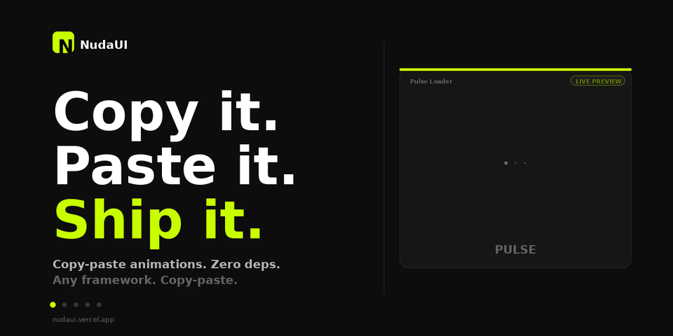

<div align="center">


# NudaUI

**Animations without the baggage.**

[](https://github.com/sgomez-dev/nudaui/stargazers)
[](./LICENSE)
[](https://github.com/sgomez-dev/nudaui/pulls)
[](https://developer.mozilla.org/en-US/docs/Web/CSS)
[](https://nudaui.dev)

[**Live site →**](https://nudaui.dev) &nbsp;·&nbsp; [**Browse components →**](https://nudaui.dev/components)

</div>

---

Copy-paste CSS & JS animations that work everywhere. No npm install, no build step, no runtime. Drop the HTML and CSS into React, Vue, Svelte, Astro, Laravel, Django, Rails, or plain HTML — and ship.

You own the code. No package to update, no API to learn, no abstraction to fight.

## Preview



## ✨ Features

- **Zero dependencies** — pure CSS, vanilla JS where needed. Nothing in your `node_modules`.
- **Copy-paste ownership** — shadcn/ui-style model. The code is yours the moment you paste it.
- **Framework-agnostic** — React, Vue, Svelte, Astro, Next, Nuxt, Laravel, Django, Rails, or a plain `.html` file.
- **Accessibility-aware** — `prefers-reduced-motion` respected, proper ARIA roles where it matters.
- **650 components across 61 categories** — loaders, charts, AI/chat, drag & drop, command palette, hero sections, pricing, video player, onboarding, terminal, footers, auth, calendars, sidebars, steppers, search & autocomplete, sliders & ranges, audio & waveforms, color pickers, galleries & carousels, maps, watch faces, quotes & testimonials, comments & reactions, profile headers, settings, file upload, tags & chips input, mobile patterns, notification center, skeleton variants & more.
- **Tailwind-friendly, Tailwind-optional** — works with your setup, not against it.

## 📦 Components

650 components, 61 categories.

| Category | Sample components | Count |
| --- | --- | --- |
| Loaders | Pulse Dots, Orbit, Ripple, Bars, Wave… | 15 |
| Text Effects | Scramble, Typewriter, Reveal, Gradient Sweep, Glitch… | 10 |
| Buttons | Magnetic, Liquid, Border Beam, Ripple, Shine, Holographic, Glitch, Neumorphic, Swipe-to-confirm, Hold-to-confirm… | 15 |
| Spinners | Ring, Dual Ring, Conic, Segment, Gradient, Cube fold, Eclipse, DNA, Pixel, Atom, Hourglass… | 14 |
| Cards & Hover | Tilt, Glow, Lift, Flip, Border Trace… | 8 |
| Micro-interactions | Like burst, Copy-check, Shake, Pulse badge… | 8 |
| 3D Effects | Card flip, Perspective hover, Depth layers, Cube… | 8 |
| Indicators | Dot pulse, Live, Status rings, Signal, Typing presence, Battery, Online cluster… | 11 |
| Progress | Linear, Radial, Segmented, Stripe, Gradient fill… | 6 |
| Backgrounds | Aurora, Mesh, Grid pulse, Noise, Gradient flow, Plasma blob, Scanlines, Starfield, Depth grid, Blueprint… | 11 |
| Toggles & Inputs | Switch, Checkbox morph, Radio fill, OTP… | 6 |
| Borders & Outlines | Animated border, Trace, Dashed flow, Glow ring… | 5 |
| Badges & Tags | New, Beta, Pulse, Count, Gradient, Ribbon, Glow, Trending… | 9 |
| Navigation | Underline slide, Pill indicator, Tabs, Dropdown… | 5 |
| Notifications | Toast, Banner, Inline alert, Stacked, Snackbar, Achievement unlock, Undo toast, Level up, System alert | 9 |
| Avatars | Ring, Status, Stack, Shimmer, Tooltip, Presence ring, Initials, Verified | 9 |
| Placeholders | Skeleton line, Block, Shimmer, Wave… | 5 |
| Accordions & Tabs | Chevron, Plus/minus, Tab slide, Stack… | 5 |
| Dividers | Gradient, Dotted, Wave, Zigzag, Sparkle, Text "OR", Animated rule, Blob, Double stripe | 9 |
| Modals & Overlays | Scale in, Slide, Backdrop blur, Drawer… | 5 |
| Countdowns | Flip, Digit roll, Ring, Segment… | 4 |
| Marquees & Tickers | Linear, Pause-on-hover, Vertical, Gradient mask, Tilted, Logo cloud, Bidirectional, 3D perspective | 8 |
| Scroll Effects | Fade in, Parallax, Reveal, Progress bar… | 4 |
| Cursors | Dot follower, Magnet, Trail, Blend, Ring follower, Magnify lens, Snap-to-link, Blob blend | 8 |
| Tooltips | Arrow, Fade, Slide, Glass, Rich card, Coachmark, Keyboard shortcut, Photo preview | 8 |
| Empty States | Empty Box, Inbox, Search, Folder, Ghost, Pulse, No notifications, No messages, Empty cart, No bookmarks | 10 |
| Charts | Bar, Line, Donut, Sparkline, Gauge, Heatmap, Area, Pie, KPI… | 10 |
| Particles & Effects | Confetti, Sparkles, Fireflies, Snow, Rain, Fireworks, Bubbles, Stars, Comet… | 10 |
| Stats & Counters | Count up, Trend card, Score ring, Streak, Live counter, Battery, Goal, Achievement… | 10 |
| Form States | Float label, Search expand, Password strength, OTP, Validation, Shake, Toggle group, Range, Step indicator, Async submit | 10 |
| Image Effects | Hover zoom, Ken Burns, Blur to focus, Color drain, Mask reveal, Tilt, Scan line, Glitch, Lightbox, Frame reveal | 10 |
| AI / Chat UI | Streaming dots, Streaming text, Chat bubble, Thinking shimmer, Prompt composer, Citations, Token counter, Model selector, Stop, Message actions | 10 |
| Drag & Drop | Drop zone, File card, Sortable, Drop indicator, Trash zone, Drag preview, Drop validation, Multi-file, Upload success, Reorder grid | 10 |
| Command Palette | Cmd-K trigger, Spotlight, Result item, Group header, No results, Searching, Recent, Footer hints, Match highlight, Quick action | 10 |
| Theme Toggle | Sun/Moon morph, Switch, Circle reveal, Three-state, Color schemes, Icon button, Dropdown, BG swap, System indicator, Slider | 10 |
| Hero Sections | Centered, Split, Mesh gradient, Word reveal, Stat row, Avatar stack, Floating cards, Newsletter, Scroll indicator, Logo cloud | 10 |
| Pricing Tables | Card, Popular tier, Billing toggle, Price morph, Feature list, Savings badge, Compare row, Currency, Discount countdown, Best value | 10 |
| Video Player UI | Play/pause morph, Scrubber, Volume, Buffer, Big play, Controls reveal, Speed, Captions, Fullscreen, Live indicator | 10 |
| Onboarding & Coachmarks | Spotlight, Tour tooltip, Step counter, Welcome modal, Feature pulse, Coach arrow, Skip, Confetti finale, New badge, Checklist | 10 |
| Code & Terminal | Terminal cursor, Typing code, Copy button, File tree, Tab bar, Syntax reveal, Error squiggle, Run button, Command output, Diff highlight | 10 |
| Footers | Minimal, Newsletter, Mega grid, Aurora glow, Status, Sticky bar, Marquee, Big brand, Social stack, Back to top | 10 |
| Login & Auth | Sign-in card, OAuth buttons, OTP input, Password reveal, Magic link, Strength meter, Auth tabs, Biometric, Verify email, Loading button | 10 |
| Calendars & Date Pickers | Mini calendar, Date range, Date popover, Time wheel, Heatmap, Month switcher, Event pill, Day timeline, Countdown pill, Schedule card | 10 |
| Sidebars & Docks | Collapse, macOS dock, Drawer slide, FAB dock, Vertical rail, Workspace switcher, Section tree, Bottom nav, Hover-reveal, Glass floating | 10 |
| Steppers & Wizards | Linear, Vertical, Progress wizard, Numbered, Onboarding carousel, Wizard tabs, Trace, Card slide, Done step, Step pill | 10 |
| Search & Autocomplete | Expanding search, Autocomplete dropdown, Match highlight, Recent, Voice mic, Loading, No results, Cmd-K, Clearable, Filter chips, Type-ahead, Shimmer, Spotlight, Sticky header, Stagger in, History pills | 16 |
| Sliders & Ranges | Basic, Dual range, Value bubble, Vertical, Stepped, Gradient fill, Histogram, Snap, Hue, Rotary knob, Brightness, Price range, Slider+input, Drag halo, Curve, Frequency | 16 |
| Audio & Waveforms | Equalizer, Voice meter, Soundwave pulse, Scrubber, Vinyl spin, Mic recording, Circular visualizer, Now playing, Amplitude rings, Play/pause morph, Mute toggle, Loop, Spectrum, Track progress, Audio loading | 15 |
| Color Pickers | Swatch grid, Gradient picker, Hue ring, Eye-dropper, Hex input, Palette generator, Recent colors, Contrast pair, Chip copy, Saturation slider | 10 |
| Galleries & Carousels | Horizontal carousel, Swipe dots, Lightbox open, Thumb strip, Masonry lift, 3D fan, Before/after, Polaroid stack, Hover zoom, Filter morph | 10 |
| Maps & Locations | Pin drop, Marker pulse, Route trace, Distance line, Geo-locating, Cluster expand, Popup card, Location search, Compass, Mini-map | 10 |
| Watch Faces & Clocks | Analog, Digital, Flip clock, Pomodoro, Stopwatch, World clock, Alarm, Countdown ring, Tick marks, Swiss railway, 24h military, Weather, Day/night, Sand hourglass, Word clock, Pulse heart, Binary, Sundial | 18 |
| Quotes & Testimonials | Pull quote, Testimonial card, 5-star rating, Signature reveal, Logo strip, Video testimonial, Rating distribution, Marquee, Carousel, Before/after, Gradient border, Animated stars, Verified, Masonry, Spotlight, Stat quote, Floating, Inline link | 18 |
| Comments & Reactions | Comment thread, Nested reply, Emoji picker, Emoji burst, Like, Dislike, Share, Reply expand, Mentions chip, Count badge, Reaction bar, Skeleton, Pinned, Highlighted, Reaction stack, Thumbs counter, Quote reply, Hover preview | 18 |
| Profile Headers | Bio card, Banner+avatar, Stat row, Social bar, Edit button, Level XP, Verified, Status presence, Follow toggle, Counter tick-up, Pronouns, Compact pill, Skeleton, Hero, Member since, Achievements, Hover card, Bio reveal | 18 |
| Settings & Preferences | Pref row, Card group, Theme selector, Notif prefs, Account, Danger zone, Save indicator, Search, Two-col, A11y, Connected apps, Plan tier, Email verify, Language picker, Time zone, Privacy row, Sound, Reset defaults | 18 |
| File Upload | Drop zone, Drop active, File list, Progress bar, Type icons, Thumbnail preview, Error, Multi-file pill, Size pill, Success check, Cancel, Total progress, Validation, Browse, Paste, Queue, Replaced, Empty | 18 |
| Tags & Chips Input | Chip input add, Remove, Autocomplete, Group select, Max count, Color variants, With icon, Drag reorder, Suggested, Overflow, Combobox, Filter bar, Avatar chip, Pop-in, Validation, Toggle all, Saved filters, Counter | 18 |
| Mobile Patterns | Bottom sheet, Pull-to-refresh, Swipe-to-delete, Action sheet, Segmented, Tab bar, FAB, Ripple, Momentum scroll, Swipe card, Status bar, Top toast, Long-press, Hamburger morph, Pull-down search, Modal, Onboarding dots, Pinch hint | 18 |
| Notification Center | Notification item, Inbox header, Time group, Filter tabs, Swipe dismiss, Inbox zero, Bulk actions, Settings row, Mention, Search, Build status, Bell with badge | 12 |
| Skeleton Variants | Message, Card, List, Table, Comment, Stat, Feed, Video, Article, Avatar stack, Dashboard, Progressive reveal | 12 |

Full catalog: [nudaui.dev/components](https://nudaui.dev/components)

## 🚀 Quick start

Pick a component on [nudaui.dev](https://nudaui.dev/components), grab the HTML and CSS, paste. That's it.

```html
<!-- Pulse Dots Loader -->
<div class="nuda-pulse-dots" role="status" aria-label="Loading">
  <span></span>
  <span></span>
  <span></span>
</div>
```

```css
.nuda-pulse-dots {
  --pulse-dots-color: #a78bfa;
  --pulse-dots-size: 12px;
  display: flex;
  align-items: center;
  gap: 6px;
  padding: 8px;
}

.nuda-pulse-dots span {
  width: var(--pulse-dots-size);
  height: var(--pulse-dots-size);
  background: var(--pulse-dots-color);
  border-radius: 50%;
  animation: nuda-pulse 1.4s ease-in-out infinite;
}

.nuda-pulse-dots span:nth-child(2) { animation-delay: 0.2s; }
.nuda-pulse-dots span:nth-child(3) { animation-delay: 0.4s; }

@keyframes nuda-pulse {
  0%, 80%, 100% { transform: scale(0.4); opacity: 0.3; }
  40%           { transform: scale(1);   opacity: 1;   }
}
```

Tweak the CSS variables, rename the class, delete what you don't need. It's your code now.

## 🤔 Why NudaUI?

| Feature | NudaUI | Traditional animation library |
| --- | --- | --- |
| Dependencies | Zero | 5+ transitive packages |
| Install | Copy-paste | `npm install` + peer deps |
| Bundle cost | 0 KB added to your build | 50–200 KB gzipped |
| Framework support | Any (HTML works everywhere) | Usually React-only |
| Code ownership | Yours, in your repo | `node_modules/` |
| Customization | Full — edit the CSS | Limited by the library's API |
| Lock-in | None | High |

Animation libraries solve a real problem — they also drag in runtimes, APIs, and bundle weight you didn't ask for. NudaUI trades the abstraction for ownership.

## 🛠 Running this site locally

The repo is the marketing site + live component playground. The components themselves are pure CSS/JS — you don't need any of this to use them.

```bash
git clone https://github.com/sgomez-dev/nudaui.git
cd nudaui
npm install
npm run dev
```

Built with Next.js 16, React 19, TypeScript, and Tailwind v4.

## 🤝 Contributing

New components, fixes, and docs improvements are very welcome. Open an [issue](https://github.com/sgomez-dev/nudaui/issues) to discuss ideas, or send a PR for small additions directly.

Good first contributions:
- A new component in an existing category (see `src/components/showcase/registry/`)
- Accessibility improvements (reduced-motion, ARIA, focus states)
- Typos, clarifications, or better code comments

## 👤 Creator

NudaUI is designed, built, and maintained by **Santiago Gómez de la Torre Romero** — sole creator, owner, and maintainer of the project.

- 🌐 [sgomez.dev](https://sgomez.dev)
- ✉️ [contact@sgomez.dev](mailto:contact@sgomez.dev)
- 💻 [github.com/sgomez-dev](https://github.com/sgomez-dev)

For project-level inquiries (press, partnerships, general contact), use [contact@nudaui.dev](mailto:contact@nudaui.dev). For anything addressed to me directly, use the email above.

## 📄 License

Component code is released under the **MIT License**, copyright © Santiago Gómez de la Torre Romero. You may use, modify, and redistribute the components freely, including in commercial work. The "NudaUI" name, branding, and marketing site copy remain the property of the creator.

MIT © [Santiago Gómez de la Torre Romero](https://sgomez.dev)

---

<div align="center">

If NudaUI saves you time, a ⭐ on the repo is the nicest way to say thanks.

[Site](https://nudaui.dev) · [Components](https://nudaui.dev/components)

</div>
